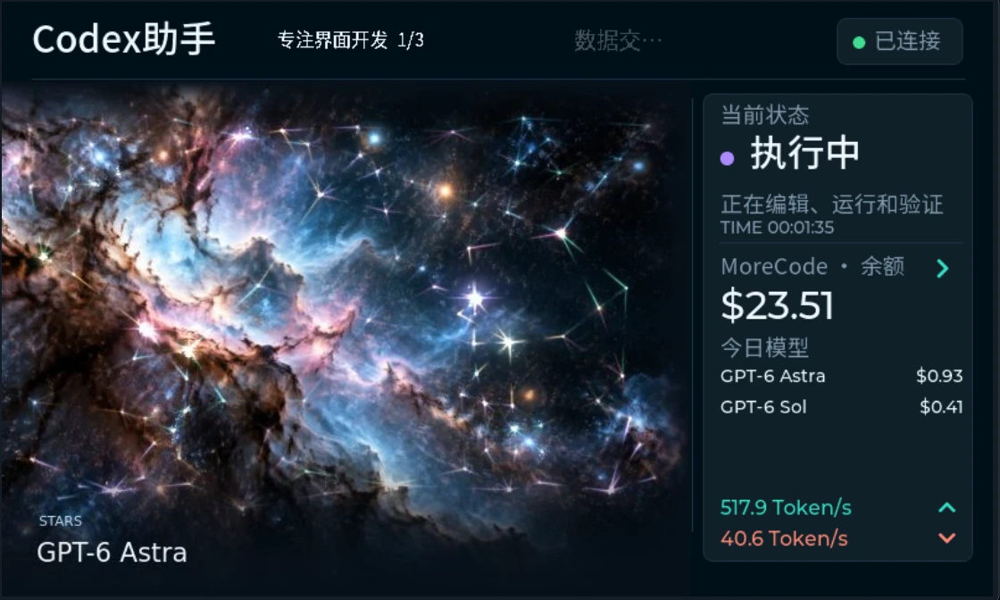
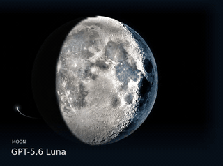
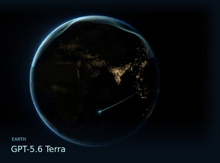
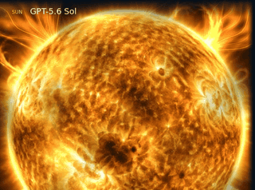
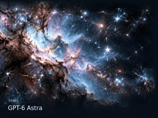
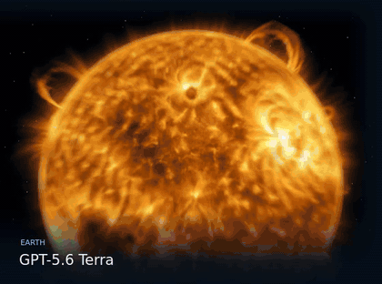
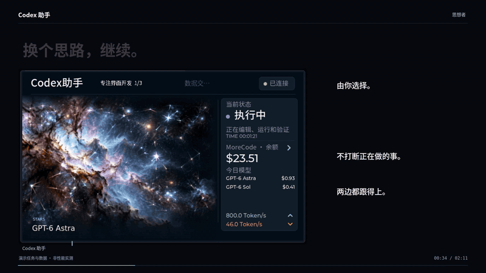
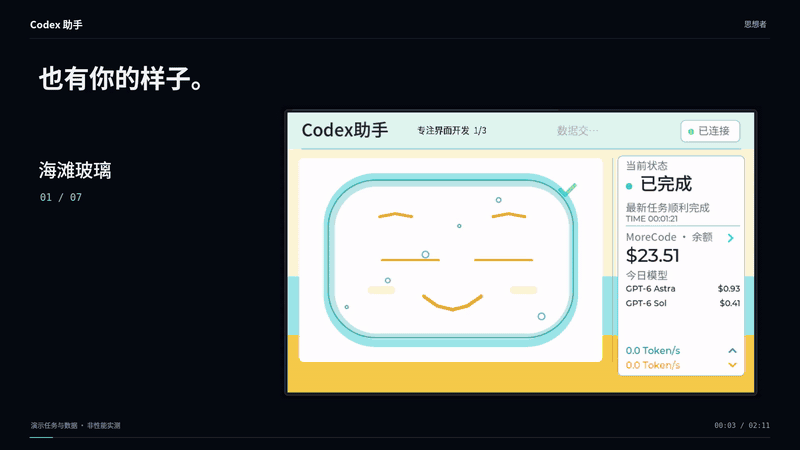

<div align="center">

# Codex 助手

**让思考，被看见。**

ESP32-P4 屏幕上的 Codex 工作伙伴。会话、进度、用量与模型，就在手边。


[下载安装](https://github.com/lvreng/codex-assistant/releases/latest) · [快速开始](#快速开始) · [使用指南](docs/SETUP.md) · [硬件与构建](docs/HARDWARE.md)



</div>

## 思想者

一套主题，四种天体。根据当前会话的模型自动选择，工作与完成各有自己的节奏。
动画从 **ESP32 的 SD 卡本地播放**，电脑只同步状态，不传视频帧。

<table>
<tr>
<td width="50%" align="center"><br><b>Luna · 月相轮转</b><br>从圆缺变化，看见思考的节奏。</td>
<td width="50%" align="center"><br><b>Terra · 城市脉动</b><br>夜色之中，光点渐次苏醒。</td>
</tr>
<tr>
<td align="center"><br><b>Sol · 恒星涌动</b><br>自转、日冕与缓慢释放的能量。</td>
<td align="center"><br><b>Astra · 群星相连</b><br>明暗之间，思绪交织。</td>
</tr>
</table>

<p align="center"></p>
<p align="center"><sub>真实项目素材的无声预览。网页动图已缩小降帧以便加载，设备 SD 素材保持原始分辨率和编码。</sub></p>

## 不只是看见

| 在屏幕上 | 在背后 |
| :--- | :--- |
| 多个对话，清楚有序 | 5 秒自动轮播，可选关闭、仅执行中或全部；触摸滑动切换对话 |
| 模型切换，就在手边 | 短按换主题，长按进模型侧栏，圆环反馈；执行中的任务完成后再应用模型 |
| 两端保持同步 | ESP32 选择与 Codex `/model` 双向同步，需要启用项目的共享控制入口 |
| 用量心中有数 | OpenAI 订阅周额度环、会员等级，或 MoreCode 余额与模型消费；输入/输出 Token/s |
| 少一根线，也能继续 | USB 优先，已配对的 Bluetooth LE 接续；动画始终本地播放 |
| 想用时，它已就绪 | Codex 启动后自动启动桥接，最后一个 Codex 与桌面助手退出后停止 |

<p align="center"></p>

## 也有你的样子

海滩玻璃、像素游戏、机械、折纸、水光玻璃、梵高星空，以及思想者。
不同的布局、字体和状态动效，不只是换一个颜色。

<p align="center"></p>

## 快速开始

**已测试组合：** JC4880P443C_I_W / ESP32-P4 rev 1.x / Ubuntu 24.04 / Python 3.12。
屏幕为 480×800，横屏界面 800×480。Bluetooth 由板载 ESP32-C6 提供，并非 P4 内置无线。

### 1. 下载

前往 [Releases](https://github.com/lvreng/codex-assistant/releases/latest)：

| 文件 | 用途 |
| --- | --- |
| `codex-assistant-runtime.zip` | 最小运行包：已编译 P4 固件、Linux 上位机、配置模板、操作说明 |
| `codex-assistant-sd.zip` | 思想者完整本地素材：9 段循环、27 段状态对齐转场、3 段独立星光分层 |
| `codex-assistant-source.zip` | 可构建源码、可选桌面窗口、测试与图文文档，不含 SDK 和构建缓存 |
| `SHA256SUMS` | 下载文件完整性校验 |

普通使用只需前两个包。SD 素材独立下载，不塞入 Git 历史，也不降低画质。

### 2. 启动上位机

在源码或最小运行包根目录：

```bash
python3 -m venv .venv
.venv/bin/python -m pip install -r host/requirements.txt
cp host/settings.example.json host/settings.json
cp host/aliases.example.json host/aliases.json
```

安装中文字体、串口权限，完成 Codex 本机登录后：

```bash
bash host/run-background.sh start
.venv/bin/python host/install_service.py --dry-run
.venv/bin/python host/install_service.py --enable
```

第一次连接请使用 USB。烧录、SD 放置方式、双向模型控制及可选桌面窗口见
[完整安装说明](docs/SETUP.md)。不要同时运行桥接、串口监视器和烧录器。

## 透明的性能与边界

- 本板独立星光分层的六组稳态测量为 **29.99–30.00 本地输出 FPS**；混合转场测试不等于锁定 30 FPS。源码中的 SIMD、PPA 与缓冲区交接优化没有重编码 SD 图片。
- 2 秒是账户接口的最小请求间隔，失败会退避。Token/s 基于会话日志的采样增量，不是逐 Token 的网络流速。
- 周额度来自支持该信息的 ChatGPT 订阅登录；OpenAI API Key 没有订阅周额度。会员到期时间由用户手动填写，不伪装成官方返回值。
- MoreCode 余额需要该网站的本机浏览器登录态，仅有推理 API Key 不足够。来源选择只改变统计来源，不替你切换推理服务。
- 模型名与可用性由你的服务商和账号决定。截图中的模型标签、余额和会话是演示数据，不是可用性承诺或模型性能排名。
- Bluetooth 需要本板 C6 固件兼容并完成 USB 首次配对；断开唯一电源后设备不会继续运行。
- 本仓库不包含任何账号认证、浏览器 Cookie、API Key 或个人会话。独立社区项目，非 OpenAI 官方产品。

更多说明：[配置与排障](docs/SETUP.md) · [硬件与编译](docs/HARDWARE.md) · [隐私与安全](SECURITY.md) · [第三方致谢](THIRD_PARTY_NOTICES.md)

<details>
<summary>仓库结构</summary>

```text
main/          ESP32-P4 固件、LVGL UI 与本地素材播放器
components/    显示驱动、包含项目修补的 LVGL port
host/          USB/BLE 桥接、用量统计、会话与模型控制
desktop/       可选 Linux 桌面弹窗
tools/         本地检查、SD 安装与发布工具
docs/          安装、硬件及真实 UI 图片/动图
```

ESP-IDF 通过组件管理器下载其他固定版本依赖。桌面、宣传片制作缓存、开发板资料全集、
旧固件、日志和原仓库历史均不进入最小运行包。

</details>
